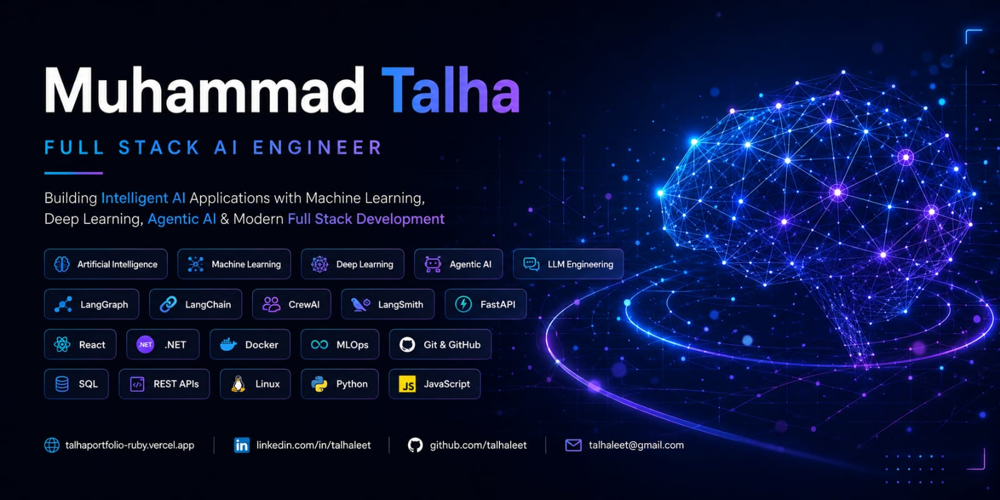

<!-- 🖼️ BANNER IMAGE — replace with your own banner -->

 

# Hi 👋 I'm Muhammad Talha

 

 

---

### 🔗 Connect With Me

---

## 🧠 About Me

Full Stack AI Engineer in training, building at the intersection of intelligent systems and modern software engineering. I care about turning raw ideas — an ambiguous business problem, a messy dataset, a rough product concept — into working systems that ship: agentic pipelines that reason and act, APIs that hold up under real traffic, and interfaces people actually want to use. My curiosity keeps pulling me toward the same question — how do we make software that *thinks*, and thinks reliably — and that question is what drives everything I build.

- 🎓 BS Software Engineering @ Punjab University College of Information Technology (PUCIT) — Class of **2027**
- 🤖 Currently focused on **Agentic AI**, **LLM Engineering**, and **Multi-Agent Systems**
- 🛠️ Building **SkillNavigator AI** — an AI Career Intelligence Platform
- 💬 Ask me about LangGraph, RAG pipelines, FastAPI, or .NET
- ⚡ Fun fact: I enjoy debugging agents almost as much as building them

---

## 🚀 Professional Introduction

I'm Muhammad Talha, a Full Stack AI Engineer who builds end-to-end — from the model layer to the pixels on screen. On the AI side, I work with LLMs, agentic frameworks like LangGraph and CrewAI, and retrieval-augmented generation to build systems that reason, plan, and act. On the software side, I build production-grade applications with React, FastAPI, and the .NET ecosystem, backed by solid API and database design.

What draws me to AI Engineering specifically is the shift from writing deterministic logic to designing systems that make decisions — architecting agents, evaluating their behavior, and getting them to work reliably in the real world. I'm most energized when a project forces me to combine both worlds: an intelligent core wrapped in software that's genuinely usable.

---

## 🤖 AI Engineering

I build agentic pipelines with **LangGraph** and **CrewAI**, orchestrate multi-step reasoning, ground responses with **RAG** over vector stores, and evaluate agent behavior with **LangSmith**. On the automation side, I connect intelligent workflows with tools like **n8n**, **Make.com**, and **Zapier**, and expose all of it through clean, typed APIs with **FastAPI** and **Pydantic**.

---

## 💻 Full Stack Development

### 🎨 Frontend

### ⚙️ Backend

### 🗄️ Databases

### 🔧 DevOps

---

## 🧰 Tech Stack

**Languages**

**Frameworks & Libraries**

**AI Frameworks**

**Databases**

**Cloud & DevOps**

**Development & Design Tools**

---

## 🌟 Featured Projects

<table>
<tr>
<td width="50%" valign="top">

### 🧭 SkillNavigator AI
**AI Career Intelligence Platform**

Agentic career-guidance platform combining multi-agent orchestration with a full-stack web application.

</td>
<td width="50%" valign="top">

### 🍔 QuickFood
**Food Ordering Web Application**

MVC-based food ordering platform with structured relational data handling.

</td>
</tr>
<tr>
<td width="50%" valign="top">

### 🛍️ Trendora
**E-Commerce Web Application**

ASP.NET MVC-based storefront application with SQL Server-backed data management.

</td>
<td width="50%" valign="top">

### 📚 Library Management System
**Library Management Web App**

Node.js/Express application for managing books, members, and lending records.

</td>
</tr>
<tr>
<td width="50%" valign="top">

### 🏫 School Management System
**School Administration Web App**

ASP.NET MVC application handling student, staff, and academic record management.

</td>
<td width="50%" valign="top">

<!-- Reserved for a future featured project -->

</td>
</tr>
</table>

---

## 🎓 Education

### Punjab University College of Information Technology (PUCIT)
**Bachelor of Science in Software Engineering**
📅 Expected Graduation: **2027**

---

### 
> *"Building intelligent software that transforms ideas into real-world impact."*
 
**Thanks for stopping by — let's build something intelligent together.** 🚀

